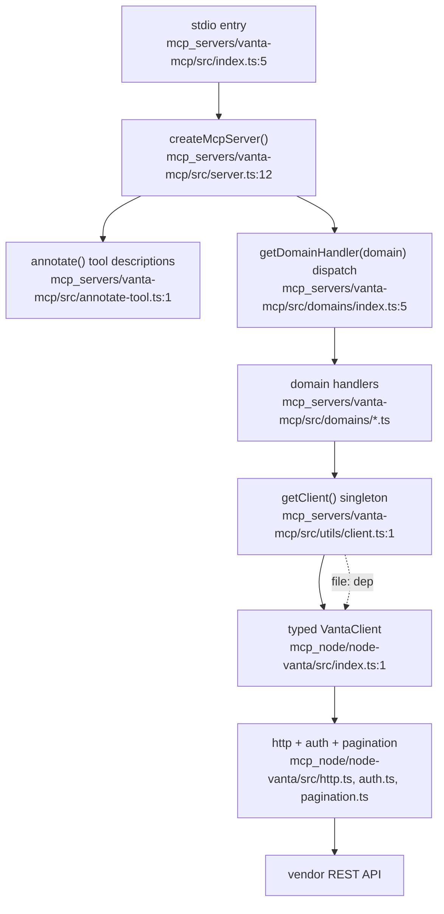

# Feature: MCP Server Fleet (mcp_servers/ + mcp_node/)

Ten stdio MCP servers under `mcp_servers/`, six backed by a typed HTTP client
layer under `mcp_node/`. The canonical shape is a three-layer stack: an MCP
wrapper (`*-mcp`) delegating to domain handlers, which call a typed client
(`node-*`), which talks to the vendor REST API. Four of the ten servers deviate
from this shape.

## Canonical stack (6 servers: vanta, blumira, ninjaone, paylocity, threatlocker, kaseya-spanning-backup)

The 6 canonical servers are structurally identical; only the vendor name,
domain list, and client type differ. `blumira`, `ninjaone`, `paylocity`,
`threatlocker`, `kaseya-spanning-backup` each mirror the vanta chart above with
their own `node-*` client.

## Deviating servers (4)

```mermaid
graph TD
  subgraph knowbe4 ["knowbe4-mcp — domains/ shape, but INLINE client"]
    K1["src/index.ts"] --> K2["domains/*"]
    K2 --> K3["INLINE client<br/>mcp_servers/knowbe4-mcp/src/utils/client.ts:1 (195 lines)"]
  end
  subgraph cipp ["cipp-mcp — services/ shape"]
    C1["src/index.ts"] --> C2["services/cipp.service.ts:1"]
    C2 --> C3["services/token.service.ts:1"]
  end
  subgraph cw ["connectwise-manage-mcp — tools/ + api-client"]
    W1["src/index.ts"] --> W2["tools/*"]
    W2 --> W3["src/api-client.ts:1"]
    W1 --> W4["src/auth/routes.ts:1"]
  end
  subgraph auvik ["auvik-mcp — tools/ + fastify, IGNORES node-auvik"]
    V1["src/index.ts"] --> V2["tools/*"]
    V2 --> V3["src/client-factory.ts:1"]
    V3 --> V4["src/http-transport.ts:1"]
    V1 --> V5["fastify dep<br/>mcp_servers/auvik-mcp/package.json:deps"]
    O["ORPHANED typed client<br/>mcp_node/node-auvik/src/index.ts:1"]
    V3 -.does NOT import.-> O
  end
```

## Structural facts (evidence)

| Server | Internal shape | Client | node-* consumed |
|---|---|---|---|
| vanta-mcp | domains/ + utils/ | node-vanta | yes |
| blumira-mcp | domains/ + utils/ | node-blumira | yes |
| ninjaone-mcp | domains/ + utils/ | node-ninjaone | yes |
| paylocity-mcp | domains/ + utils/ | node-paylocity | yes |
| threatlocker-mcp | domains/ + utils/ | node-threatlocker | yes |
| kaseya-spanning-backup-mcp | domains/ + utils/ | node-spanning | yes |
| knowbe4-mcp | domains/ + utils/ | INLINE (195 lines) | no |
| cipp-mcp | services/ + utils/ | INLINE | no |
| connectwise-manage-mcp | tools/ + api-client.ts | INLINE | no |
| auvik-mcp | tools/ + fastify | INLINE (client-factory) | no (node-auvik orphaned) |

Shared reference copy `mcp_servers/_shared/` (held the canonical
`annotate-tool.ts`, `pack-mcpb.js`, `error-envelope.ts`, `response-shaper.ts`,
`base-url.ts`) was deleted in commit 56d1a9f. The copies it seeded still live in
each server, now with no canonical source to sync from.
